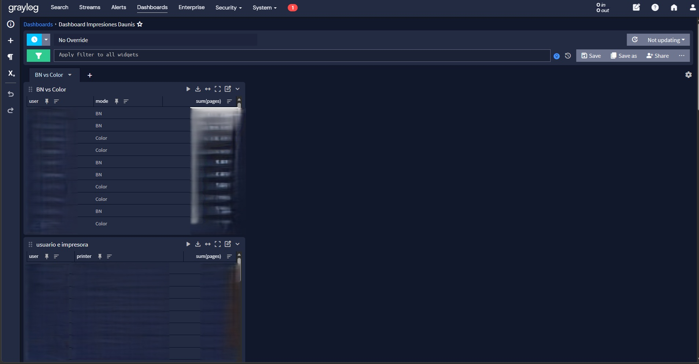
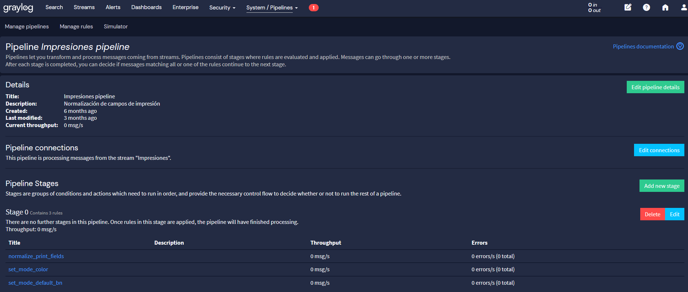
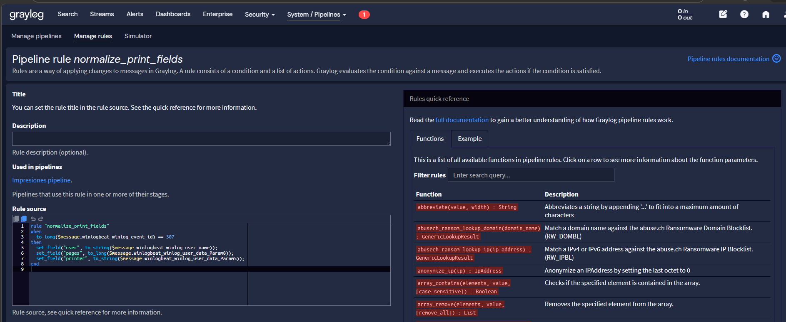
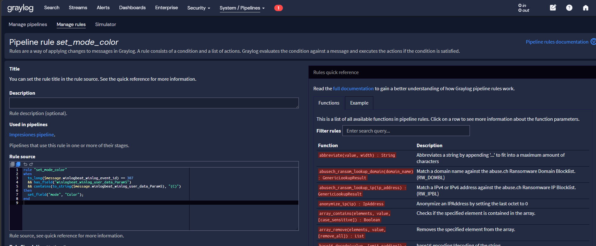
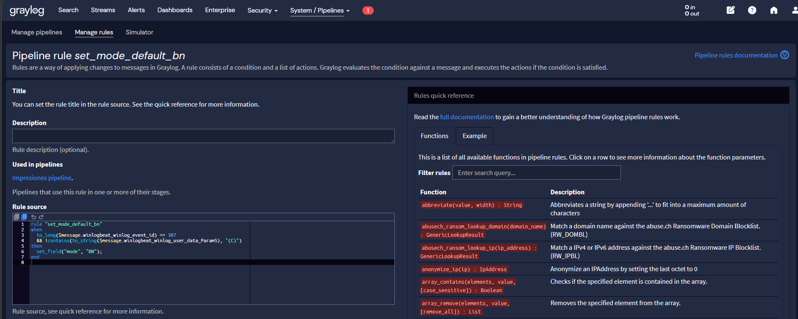
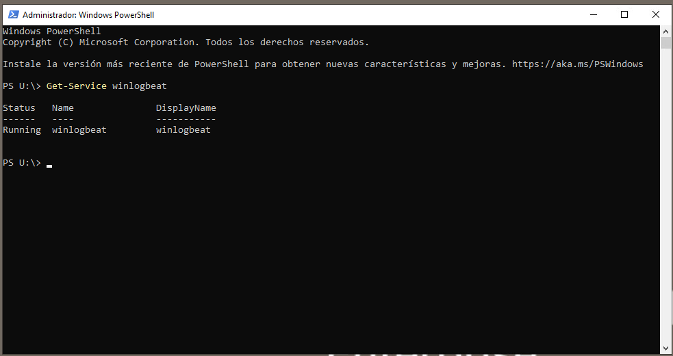
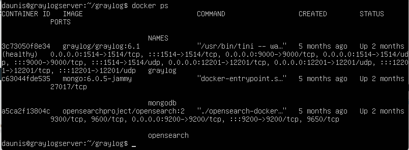

# Graylog Print Monitoring

Proyecto de monitorización de impresiones usando Graylog en entorno Windows, orientado a centralizar eventos de impresión y visualizar la actividad de forma clara mediante dashboards.

## Descripción

Este proyecto consiste en una solución de monitorización de impresiones basada en Graylog, diseñada para recoger eventos desde un servidor de impresión Windows, procesarlos mediante pipelines y mostrarlos en dashboards con información útil para análisis y control.

La solución permite:
- contabilizar impresiones realizadas
- identificar qué usuarios imprimen más
- ver qué impresoras tienen mayor uso
- diferenciar impresiones en color y en blanco y negro
- consultar los datos desde paneles visuales

## Objetivo

El objetivo del proyecto fue construir un sistema centralizado de recogida y visualización de eventos de impresión para facilitar el seguimiento del consumo y mejorar el análisis de uso de impresoras.

## Tecnologías utilizadas

- Graylog
- Winlogbeat
- Windows Print Server
- Docker
- OpenSearch
- VMware / máquina virtual Linux

## Flujo de funcionamiento

1. El servidor de impresión Windows genera eventos de impresión.
2. Winlogbeat recoge esos eventos desde el canal `Microsoft-Windows-PrintService/Operational`.
3. Los eventos se envían hacia Graylog.
4. Graylog procesa los logs mediante reglas de pipeline.
5. Los datos ya normalizados se visualizan en dashboards.

## Procesamiento de logs

Se implementó un pipeline para normalizar la información y clasificar el tipo de impresión.

### Reglas principales

- `normalize_print_fields`
  - extrae usuario
  - extrae páginas
  - extrae nombre de impresora

- `set_mode_color`
  - marca impresiones a color

- `set_mode_default_bn`
  - marca impresiones en blanco y negro

## Capturas del proyecto

## 1. Dashboard principal
Vista general del panel de monitorización con métricas de uso por usuario, impresora y tipo de impresión.

## 2. Vista general del pipeline
Configuración general del pipeline encargado de procesar los eventos de impresión.

## 3. Regla normalize_print_fields
Regla encargada de extraer y normalizar los campos principales del evento.

## 4. Regla set_mode_color
Regla utilizada para identificar impresiones a color.

## 5. Regla set_mode_bn
Regla utilizada para identificar impresiones en blanco y negro.

## 6. Servicio Winlogbeat en Windows
Comprobación de que Winlogbeat está activo en el servidor Windows encargado de enviar los eventos.

## 7. Despliegue de Graylog en Docker
Evidencia del despliegue del entorno Graylog mediante contenedores.

## Resultados

Con esta solución se consiguió:
- centralizar los eventos de impresión
- visualizar datos en tiempo real
- distinguir impresiones en color y blanco y negro
- identificar usuarios e impresoras con mayor actividad
- mejorar el análisis del uso de impresión desde una interfaz visual

## Qué he hecho yo

En este proyecto me encargué de:
- desplegar el entorno Graylog
- configurar el envío de eventos desde Windows con Winlogbeat
- diseñar y crear las reglas del pipeline
- normalizar los campos de impresión
- diferenciar el tipo de impresión
- montar los dashboards de visualización
- validar el funcionamiento de extremo a extremo

## Notas

Por motivos de confidencialidad, las capturas publicadas en este repositorio han sido anonimizadas y no incluyen información sensible del entorno original.

## Autor

**Ibrahem Laktibi**
